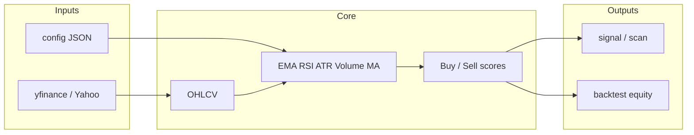

# Stock market bot (Python)

CLI tool for **rule-based signals** and a simple **backtest** on **daily (or other) OHLCV** from **Yahoo Finance** (`yfinance`). This folder is **independent** of the root **Huobi / Node.js** demos.

| Do's | Don'ts |
|------|--------|
| **Does** | Fetch history, compute EMA / RSI / ATR / volume averages, score bars, `signal` / `scan` / `dump` / `backtest`. |
| **Does not** | Connect to a broker, stream live ticks, or place orders. |

---

## Requirements

- **Python 3.10+** recommended (3.14 works if dependencies install cleanly).
- Internet access for Yahoo.

---

## Setup (Windows)

From the `stock_market_bot` directory:

```powershell
python -m venv .venv
.\.venv\Scripts\Activate.ps1
python -m pip install -r requirements.txt
```

Use `source .venv/bin/activate` on macOS/Linux. If `pip` is not on PATH, use `python -m pip` as shown.

---

## How it works (pipeline)

1. **Data:** `yfinance` loads OHLCV for your symbol and `period` / `interval`.
2. **Indicators:** Fast EMA, slow EMA, trend EMA, RSI, volume vs rolling mean, ATR (and ATR% for optional filtering). Implemented in `indicators.py`.
3. **Scoring:** Each bar gets a **buy score** (up to 4) and **sell score** from `strategy.py` (trend alignment, RSI band, volume confirmation; optional `max_atr_pct` penalty).
4. **Labels:** BUY if buy score ≥ `buy_score_min` (default 3), SELL if sell score ≥ `sell_score_min` (default 2); if both, **SELL wins** (risk-off).
5. **Backtest:** Long-only: invest full cash on BUY, flat on SELL, with configurable commission and slippage (`backtest.py`).



---

## Configuration

Copy `config.example.json` to e.g. `my_config.json` and edit:

- `watchlist` — tickers for `scan` when you do not pass `--symbols`.
- `strategy` — EMA lengths, RSI thresholds, `buy_score_min` / `sell_score_min`, optional `"max_atr_pct"` (e.g. `0.03` to dampen buys in very high ATR%).
- `backtest` — `initial_cash`, `commission_pct`, `slippage_pct`.

Pass a file with `-c` on the subcommand (required placement for argparse):

```powershell
python run.py scan -c config.example.json --period 6mo
python run.py signal -c my_config.json --symbol SPY --period 1y
```

Without `-c`, built-in defaults apply (including a small default watchlist).

---

## Commands

Run from the `stock_market_bot` folder (venv activated).

| Command | Purpose |
|---------|---------|
| `python run.py signal --symbol SPY --period 1y` | Latest bar: scores + **BUY / SELL / HOLD** (rules only, not advice). |
| `python run.py scan --symbols SPY,QQQ,AAPL --period 6mo` | Screen those tickers; sorted by bullish vs bearish score spread. |
| `python run.py scan -c my_config.json --period 6mo` | Scan `watchlist` from config. |
| `python run.py backtest --symbol SPY --period 2y` | Long-only simulation using config fees/slippage. |
| `python run.py dump --symbol AAPL --last 20` | Recent rows: price, indicators, scores, signal (debug / context). |

Optional: `--interval` on `signal`, `backtest`, and `dump` (e.g. `1d`; intraday availability from Yahoo varies).

---

## Limitations

- **Not financial advice.** Yahoo data may differ from your broker (splits, adjustments, delays).
- **No execution layer** — by design.
- **Backtests** are simplified (e.g. long-only, all-in sizing); they are for learning and rough comparison, not a promise of live performance.

---

## Example output (abbreviated)

**signal**

```text
Symbol: SPY  (last bar: 2026-04-02 00:00:00-04:00)
Close: 655.8300
Buy score: 1/4  Sell score: 1/4
Suggested action (rules only): HOLD
Factors: {'ema_bear': True, 'below_trend': True, 'rsi_ok': True}
```

**scan**

```text
Scanning 3 symbols (period=6mo)...

Ticker   Action  Buy Sell        Close
SPY      HOLD      1    1       655.83
QQQ      HOLD      1    1       584.98
AAPL     HOLD      1    1       255.92
```

**backtest**

```text
Symbol: SPY
Period: 2y  Interval: 1d
Initial: $100,000.00
Final:   $129,801.58
Return:  29.80%
Max DD:  -18.76%
```

**dump** (first and last few lines of a typical run)

```text
Date        close    ema_fast  ema_slow  rsi      buy_score   sell_score   signal
2026-03-06  257.46   263.98    264.86    40.88    1           1            HOLD
2026-04-02  255.92   253.11    255.50    50.37    1           1            HOLD
...
```

---

## Project layout

| File                  | Role                        |
|-----------------------|-----------------------------|
| `run.py`              | CLI entrypoint              |
| `data_provider.py`    | Yahoo OHLCV fetch           |
| `indicators.py`       | EMA, RSI, ATR, volume MA    |
| `strategy.py`         | Per-bar scoring and signals |
| `backtest.py`         | Long-only backtest          |
| `config.example.json` | Sample settings             |
