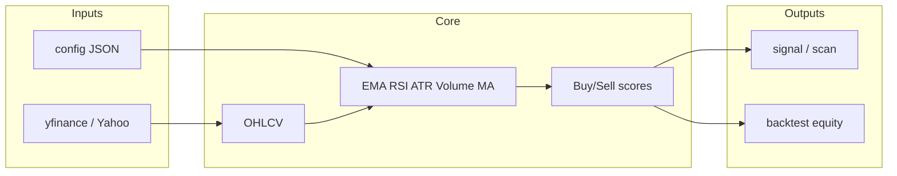

# Stock Market Bot:

## What you have

Your repo is still **Huobi crypto** demo (`demo_sdk.js`, etc.). A separate **Python stock toolkit** lives in `stock_market_bot\`. It does **not** place real trades unless you later plug in a broker API (Alpaca, Interactive Brokers, etc.). It focuses on **data → indicators → scored signals → optional backtest**, which is the safer and more useful core for a “stronger” bot.

### Why this is “stronger” than a single indicator

- **Multi-factor scoring** (up to 4 bullish points): fast vs slow EMA, price vs trend EMA, RSI band, volume vs its average.
- **Explicit exits**: EMA rollunder & hot RSI raise a **sell score**; overlapping buy+sell favors **risk-off (SELL)**.
- **Optional chop filter**: set `"max_atr_pct"` in config to penalize buys when **ATR%** is very high (volatile, noisy regimes).
- **Backtest** includes **commission** and **slippage** so results are less naive than raw signals.
- **Scan** ranks a **watchlist** for today’s scores.

Flow:


## How to use it (Windows)

1. **Install dependencies** (once):
```powershell
cd c:\Users\josep\Downloads\bitcoinRobot-master\stock_market_bot
python -m pip install -r requirements.txt
```

2. **Optional:** copy `config.example.json` to e.g. `my_config.json` and edit `watchlist`, EMA lengths, `buy_score_min` / `sell_score_min`, and optionally `"max_atr_pct": 0.03` (3% of price — tune to your taste).

3. **Commands:**

| Command 				| Purpose 				|
|-----------------|-----------------|
| `python run.py signal --symbol SPY --period 1y` | Latest bar: scores + **BUY / SELL / HOLD** (rule-based, not advice) |
| `python run.py scan --period 6mo` | Uses `watchlist` from `-c` config, or pass `--symbols SPY,QQQ,AAPL`. |
| `python run.py backtest --symbol SPY --period 2y` | Long-only sim with fees/slippage from config. |
| `python run.py dump --symbol AAPL --last 20` | Debug table of recent bars and signals. |
| `python run.py ... -c my_config.json` | Load your JSON overrides. |

Example with config:
```powershell
python run.py scan -c config.example.json --period 6mo
```

## Important limitations
- **Not financial advice**; Yahoo data can be delayed or adjusted differently than your broker; backtests are **not** guarantees.
- **No live execution** is wired in — on purpose. Hooking a broker means API keys, order types, and compliance; that should be a deliberate second step.
- For **intraday** intervals, Yahoo’s availability & delays vary; daily bars are most reliable for this stack.

---

# what it is and what you can do with it:

## What it is

It’s a **small Python research tool** in `stock_market_bot\`, not a running server and **not** something that logs into your brokerage and trades by itself.

1. **Pulls price history** (open/high/low/close/volume) from **Yahoo Finance** via `yfinance`.
2. **Computes indicators**: fast/slow/trend EMAs, RSI, volume vs its average, ATR (& ATR% for optional volatility filtering).
3. **Scores each bar** with simple rules:
   - **Buy score** (up to 4): e.g. fast EMA above slow, price above trend EMA, RSI not too high, volume above average.
   - **Sell score**: e.g. fast below slow, RSI very high; if buy & sell both “fire,” it **prefers SELL** (risk-off).
4. Optionally **penalizes buys** when volatility (ATR%) is above `max_atr_pct` in config (if you set it).
5. **`backtest`** simulates a **long-only** strategy: go all-in on BUY, exit on SELL, with **commission and slippage** from config — so you see rough performance, not guaranteed future results.

So “bot” here means **automated rule engine + backtest**, not an autonomous trader.

## What you can use it for
- **Daily (or other) check**: “What does *my* rule set say for SPY today?” → `signal`.
- **Screen a list**: rank tickers by same logic → `scan` (watchlist in config file or `--symbols`).
- **Sanity-check the rules on history**: does this simple system behave horribly in drawdowns? → `backtest`.
- **Tune parameters**: copy `config.example.json`, change EMA lengths, `buy_score_min` / `sell_score_min`, `max_atr_pct`, fees — then rerun `signal` / `scan` / `backtest`.

## Concrete commands (from `stock_market_bot` folder)

After `python -m pip install -r requirements.txt`:
```python
python run.py signal --symbol SPY --period 1y
python run.py scan --symbols SPY,QQQ,AAPL --period 6mo
python run.py scan -c config.example.json --period 6mo
python run.py backtest --symbol SPY --period 2y
python run.py dump --symbol AAPL --last 20
```

`-c path\to\config.json` loads your watchlist and strategy numbers.

## What you cannot do with it as built

- It does **not** place orders, manage a portfolio at a broker, or stream live ticks.
- It is **not** optimized or validated for live trading; Yahoo data and a toy backtest are for **learning and prototyping**, not a promise of edge.

**Bottom line:** use it to **generate and test transparent, rule-based stock *signals*** and **rough backtests** on symbols you choose. Anything “real” (paper/live trading) would be a separate layer you’d add on top with a broker API and your own risk controls.

---

## Example Commands Output:

1. 
```sh
(.venv) <stock_market_bot>  python run.py signal --symbol SPY --period 1y
Symbol: SPY  (last bar: 2026-04-02 00:00:00-04:00)
Close: 655.8300
Buy score: 1/4  Sell score: 1/4
Suggested action (rules only): HOLD
Factors: {'ema_bear': True, 'below_trend': True, 'rsi_ok': True}
```

2. 
```sh
(.venv) <stock_market_bot>  python run.py scan --symbols SPY,QQQ,AAPL --period 6mo
Scanning 3 symbols (period=6mo)...

Ticker   Action  Buy Sell        Close
SPY      HOLD      1    1       655.83
QQQ      HOLD      1    1       584.98
AAPL     HOLD      1    1       255.92
```

3. 
```sh
(.venv) <stock_market_bot>  python run.py backtest --symbol SPY --period 2y
Symbol: SPY
Period: 2y  Interval: 1d
Initial: $100,000.00
Final:   $129,801.58
Return:  29.80%
Max DD:  -18.76%
```

4. 
```sh
(.venv) <stock_market_bot\>  python run.py dump --symbol AAPL --last 20

Date              close       ema_fast    ema_slow    rsi     buy_score sell_score  signal
2026-03-06 05:00  257.459991  263.979106  264.863869  40.879125   1        1        HOLD
2026-03-06 05:00  257.459991  263.979106  264.863869  40.879125   1        1        HOLD
2026-03-06 05:00  257.459991  263.979106  264.863869  40.879125   1        1        HOLD
2026-03-06 05:00  257.459991  263.979106  264.863869  40.879125   1        1        HOLD
2026-03-06 05:00  257.459991  263.979106  264.863869  40.879125   1        1        HOLD
2026-03-06 05:00  257.459991  263.979106  264.863869  40.879125   1        1        HOLD
2026-03-06 05:00  257.459991  263.979106  264.863869  40.879125   1        1        HOLD
2026-03-06 05:00  257.459991  263.979106  264.863869  40.879125   1        1        HOLD
2026-03-06 05:00  257.459991  263.979106  264.863869  40.879125   1        1        HOLD
2026-03-06 05:00  257.459991  263.979106  264.863869  40.879125   1        1        HOLD
2026-03-06 05:00  257.459991  263.979106  264.863869  40.879125   1        1        HOLD
2026-03-06 05:00  257.459991  263.979106  264.863869  40.879125   1        1        HOLD
2026-03-06 05:00  257.459991  263.979106  264.863869  40.879125   1        1        HOLD
2026-03-06 05:00  257.459991  263.979106  264.863869  40.879125   1        1        HOLD
2026-03-06 05:00  257.459991  263.979106  264.863869  40.879125   1        1        HOLD
2026-03-06 05:00  257.459991  263.979106  264.863869  40.879125   1        1        HOLD
2026-03-06 05:00  257.459991  263.979106  264.863869  40.879125   1        1        HOLD
2026-03-06 05:00  257.459991  263.979106  264.863869  40.879125   1        1        HOLD
2026-03-06 05:00  257.459991  263.979106  264.863869  40.879125   1        1        HOLD
2026-03-06 05:00  257.459991  263.979106  264.863869  40.879125   1        1        HOLD
2026-03-06 05:00  257.459991  263.979106  264.863869  40.879125   1        1        HOLD
2026-03-06 05:00  257.459991  263.979106  264.863869  40.879125   1        1        HOLD
2026-03-06 05:00  257.459991  263.979106  264.863869  40.879125   1        1        HOLD
2026-03-06 05:00  257.459991  263.979106  264.863869  40.879125   1        1        HOLD
2026-03-06 05:00  257.459991  263.979106  264.863869  40.879125   1        1        HOLD
2026-03-06 05:00  257.459991  263.979106  264.863869  40.879125   1        1        HOLD
2026-03-06 05:00  257.459991  263.979106  264.863869  40.879125   1        1        HOLD
2026-03-06 05:00  257.459991  263.979106  264.863869  40.879125   1        1        HOLD
2026-03-06 05:00  257.459991  263.979106  264.863869  40.879125   1        1        HOLD
2026-03-06 05:00  257.459991  263.979106  264.863869  40.879125   1        1        HOLD
2026-03-06 05:00  257.459991  263.979106  264.863869  40.879125   1        1        HOLD
2026-03-06 05:00  257.459991  263.979106  264.863869  40.879125   1        1        HOLD
2026-03-06 05:00  257.459991  263.979106  264.863869  40.879125   1        1        HOLD
2026-03-06 05:00  257.459991  263.979106  264.863869  40.879125   1        1        HOLD
2026-03-06 05:00  257.459991  263.979106  264.863869  40.879125   1        1        HOLD
2026-03-06 05:00  257.459991  263.979106  264.863869  40.879125   1        1        HOLD
2026-03-06 05:00  257.459991  263.979106  264.863869  40.879125   1        1        HOLD
2026-03-06 05:00  257.459991  263.979106  264.863869  40.879125   1        1        HOLD
2026-03-06 05:00  257.459991  263.979106  264.863869  40.879125   1        1        HOLD
2026-03-06 05:00  257.459991  263.979106  264.863869  40.879125   1        1        HOLD
2026-03-06 05:00  257.459991  263.979106  264.863869  40.879125   1        1        HOLD
2026-03-06 05:00  257.459991  263.979106  264.863869  40.879125   1        1        HOLD
2026-03-06 05:00  257.459991  263.979106  264.863869  40.879125   1        1        HOLD
2026-03-06 05:00  257.459991  263.979106  264.863869  40.879125   1        1        HOLD
2026-03-06 05:00  257.459991  263.979106  264.863869  40.879125   1        1        HOLD
2026-03-06 05:00  257.459991  263.979106  264.863869  40.879125   1        1        HOLD
2026-03-06 05:00  257.459991  263.979106  264.863869  40.879125   1        1        HOLD
2026-03-06 05:00  257.459991  263.979106  264.863869  40.879125   1        1        HOLD
2026-03-06 05:00  257.459991  263.979106  264.863869  40.879125   1        1        HOLD
2026-03-06 05:00  257.459991  263.979106  264.863869  40.879125   1        1        HOLD
2026-03-06 05:00  257.459991  263.979106  264.863869  40.879125   1        1        HOLD
2026-03-06 05:00  257.459991  263.979106  264.863869  40.879125   1        1        HOLD
2026-03-06 05:00  257.459991  263.979106  264.863869  40.879125   1        1        HOLD
2026-03-06 05:00  257.459991  263.979106  264.863869  40.879125   1        1        HOLD
2026-03-06 05:00  257.459991  263.979106  264.863869  40.879125   1        1        HOLD
2026-03-06 05:00  257.459991  263.979106  264.863869  40.879125   1        1        HOLD
2026-03-06 05:00  257.459991  263.979106  264.863869  40.879125   1        1        HOLD
2026-03-06 05:00  257.459991  263.979106  264.863869  40.879125   1        1        HOLD
2026-03-06 05:00  257.459991  263.979106  264.863869  40.879125   1        1        HOLD
2026-03-06 05:00  257.459991  263.979106  264.863869  40.879125   1        1        HOLD
2026-03-06 05:00  257.459991  263.979106  264.863869  40.879125   1        1        HOLD
2026-03-06 05:00  257.459991  263.979106  264.863869  40.879125   1        1        HOLD
2026-03-06 05:00  257.459991  263.979106  264.863869  40.879125   1        1        HOLD
2026-03-06 05:00  257.459991  263.979106  264.863869  40.879125   1        1        HOLD
2026-03-06 05:00  257.459991  263.979106  264.863869  40.879125   1        1        HOLD
2026-03-06 05:00  257.459991  263.979106  264.863869  40.879125   1        1        HOLD
2026-03-06 05:00  257.459991  263.979106  264.863869  40.879125   1        1        HOLD
2026-03-06 05:00  257.459991  263.979106  264.863869  40.879125   1        1        HOLD
2026-03-09 04:00  259.880005  263.348475  264.494694  44.196480   1        1        HOLD
2026-03-10 04:00  260.829987  262.961016  264.223234  45.489524   1        1        HOLD
2026-03-11 04:00  260.809998  262.630090  263.970402  45.465652   1        1        HOLD
2026-03-12 04:00  255.759995  261.573152  263.362223  39.785107   1        1        HOLD
2026-03-13 04:00  250.119995  259.811128  262.381318  34.587558   1        1        HOLD
2026-03-16 04:00  252.820007  258.735571  261.673072  38.715201   1        1        HOLD
2026-03-17 04:00  254.229996  258.042405  261.121733  40.815515   1        1        HOLD
2026-03-18 04:00  249.940002  256.795882  260.293457  36.694893   1        1        HOLD
2026-03-19 04:00  248.960007  255.590363  259.453942  35.805608   1        1        HOLD
2026-03-20 04:00  247.990005  254.421077  258.604762  34.903949   2        1        HOLD
2026-03-23 04:00  251.490005  253.970143  258.077743  40.706014   1        1        HOLD
2026-03-24 04:00  251.639999  253.611659  257.600873  40.948924   2        1        HOLD
2026-03-25 04:00  252.619995  253.459096  257.231919  42.603386   1        1        HOLD
2026-03-26 04:00  252.889999  253.371542  256.910295  43.076593   2        1        HOLD
2026-03-27 04:00  248.800003  252.668229  256.309533  37.969885   2        1        HOLD
2026-03-30 04:00  246.630005  251.739271  255.592531  35.561110   1        1        HOLD
2026-03-31 04:00  253.789993  252.054767  255.459010  47.414900   2        1        HOLD
2026-04-01 04:00  255.630005  252.604803  255.471676  49.962313   1        1        HOLD
2026-04-02 04:00  255.919998  253.114833  255.504885  50.370378   1        1        HOLD
```